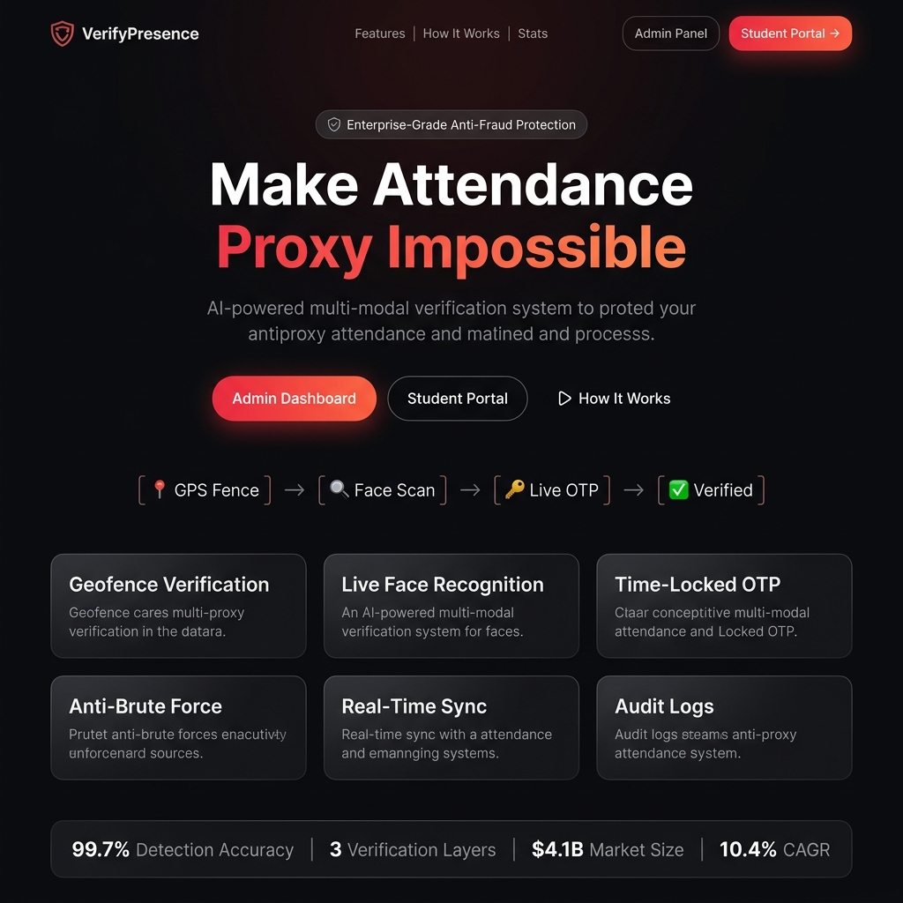
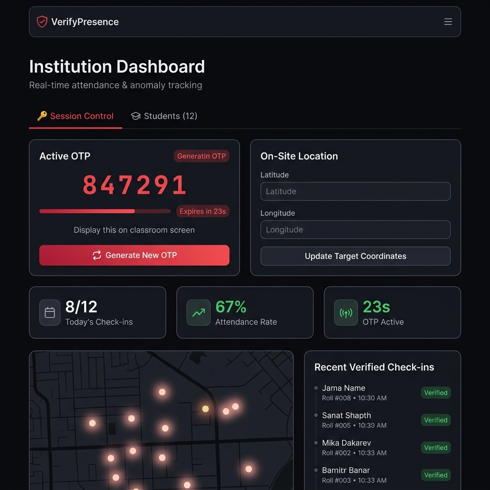
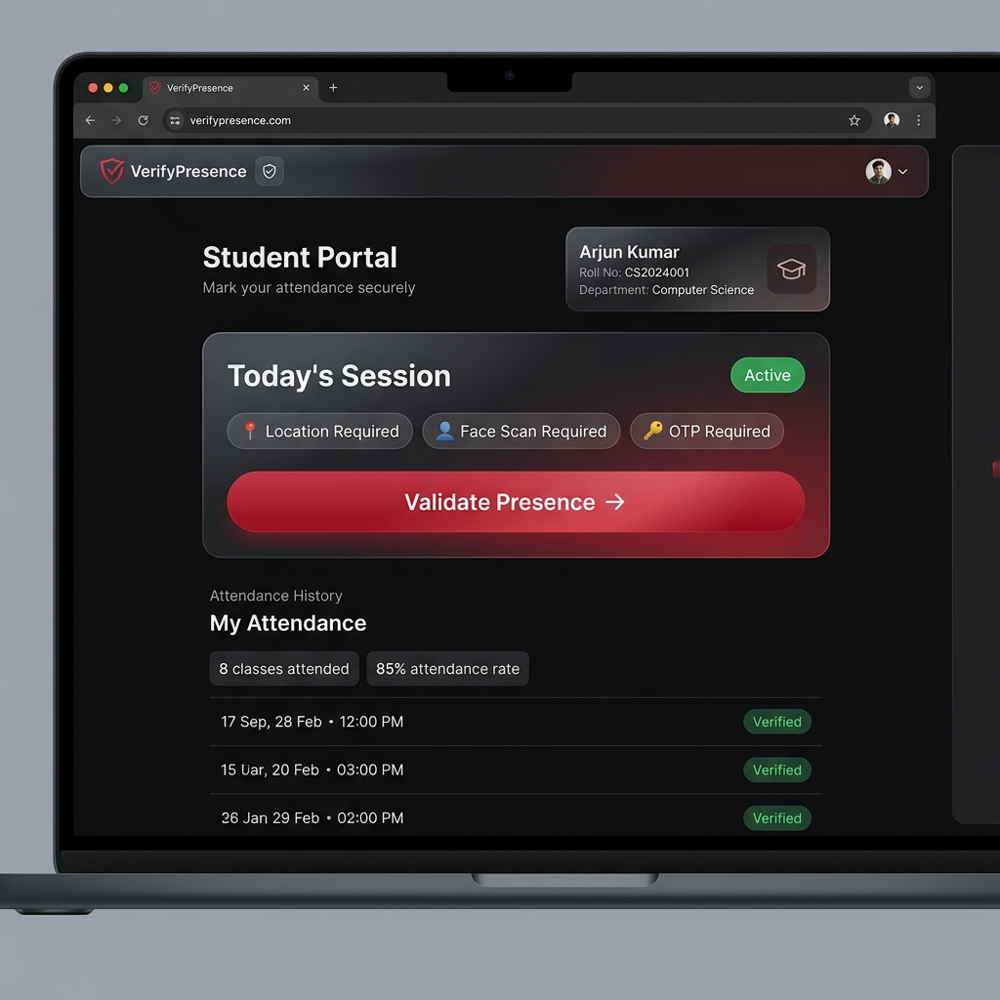
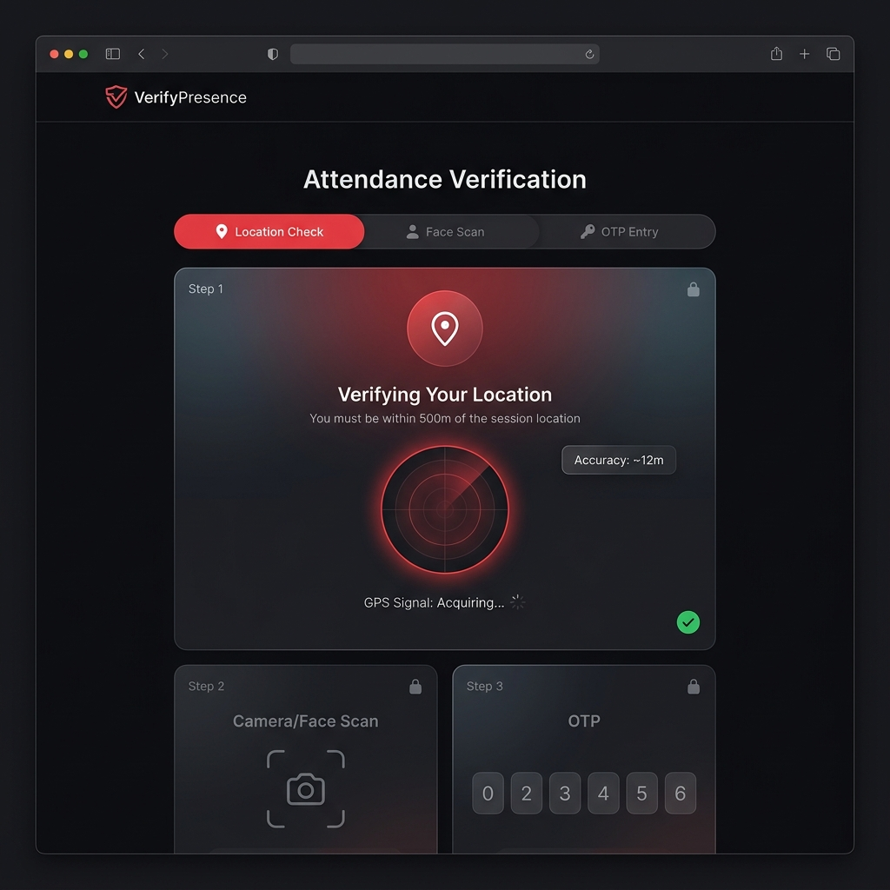

<div align="center">


# 🛡️ VerifyPresence
### *Make Attendance Proxy Impossible*

**AI-powered, multi-modal attendance verification system that eliminates buddy punching, photo spoofing, and GPS faking — for colleges and enterprises.**

[🔴 Live Demo](https://YOUR-VERCEL-URL.vercel.app) · [📱 Admin Panel](https://YOUR-VERCEL-URL.vercel.app/admin) · [🎓 Student Portal](https://YOUR-VERCEL-URL.vercel.app/student) · [🔍 Try Verification](https://YOUR-VERCEL-URL.vercel.app/verify)

</div>

---

## 📸 Screenshots

| Landing Page | Admin Dashboard |
|:---:|:---:|
|  |  |

| Student Portal | Verification Flow |
|:---:|:---:|
|  |  |

---

## 🎯 The Problem

Proxy attendance (marking absent students as present) is rampant in colleges and workplaces. Existing solutions — RFID cards, simple biometrics — can be bypassed by sharing cards or photos.

**VerifyPresence** uses **3 simultaneous, unbypassable verification gates** that must all pass — in order.

---

## ✅ Verification Pipeline

```
📍 GPS Geofence  ──►  👤 Live Face Scan  ──►  🔑 Time-Locked OTP  ──►  ✅ Logged
```

| Gate | Technology | What it blocks |
|------|-----------|---------------|
| **GPS Geofence** | Browser Geolocation API | Remote attendance, VPN-based location faking |
| **Live Face Recognition** | face-api.js (on-device AI) | Photo attacks, pre-recorded videos, screen spoofing |
| **Time-Locked OTP** | Firebase Firestore (real-time) | Shared codes, stored OTPs, replay attacks |

Each step is **server-validated** and **non-skippable** — client-side manipulation is impossible.

---

## ⚡ Key Features

- 🌐 **Real-time sync** — Admin OTP & location changes propagate to all students instantly via Firebase
- 🔒 **Anti-brute force** — 5 wrong OTP attempts trigger a 10-minute lockout
- 📡 **Offline resilience** — Works with localStorage fallback when Firebase is temporarily unreachable
- 🗺️ **Live heatmap** — Admin sees student check-in GPS dots on a real-time map
- 📊 **Audit logs** — Every attempt (success/failure) is timestamped and stored in Firestore
- 📱 **Mobile-first** — Capacitor-ready for Android APK generation

---

## 🏗️ Tech Stack

| Layer | Technology |
|-------|-----------|
| **Frontend** | React 19 + Vite 8 |
| **Routing** | React Router DOM v7 |
| **UI Icons** | Lucide React |
| **AI / Vision** | face-api.js (TinyFaceDetector, SSD MobileNet) |
| **Backend / DB** | Firebase Firestore (real-time NoSQL) |
| **Auth** | Firebase Authentication |
| **Mobile** | Capacitor (Android) |
| **Deployment** | Vercel / Firebase Hosting |

---

## 🚀 Getting Started

### Prerequisites
- Node.js 18+
- npm or yarn
- A Firebase project (free Spark plan works)

### 1. Clone the repo
```bash
git clone https://github.com/YOUR-USERNAME/proxy-attendance.git
cd proxy-attendance
```

### 2. Install dependencies
```bash
npm install
```

### 3. Set up Firebase
Create a `.env` file in the root (copy from `.env.example`):
```env
VITE_FIREBASE_API_KEY=your_api_key
VITE_FIREBASE_AUTH_DOMAIN=your_project.firebaseapp.com
VITE_FIREBASE_PROJECT_ID=your_project_id
VITE_FIREBASE_STORAGE_BUCKET=your_project.appspot.com
VITE_FIREBASE_MESSAGING_SENDER_ID=your_sender_id
VITE_FIREBASE_APP_ID=your_app_id
```

### 4. Run locally
```bash
npm run dev
```
Open [http://localhost:5173](http://localhost:5173) 🎉

---

## 📂 Project Structure

```
proxy-attendance/
├── src/
│   ├── pages/
│   │   ├── LandingPage/        # Marketing landing page
│   │   ├── AdminDashboard/     # OTP control + student management + heatmap
│   │   ├── StudentDashboard/   # Student portal + attendance history
│   │   └── VerificationFlow/  # 3-step verification wizard
│   ├── components/
│   │   ├── TopNav/             # Sticky navigation bar
│   │   ├── GlassCard/          # Glassmorphism card component
│   │   └── PrimaryButton/      # Styled CTA button
│   ├── services/
│   │   └── firebase.js         # Firebase initialization
│   └── utils/
│       └── otpVerification.js  # OTP caching & validation logic
├── public/
│   └── models/                 # face-api.js AI model weights
├── screenshots/                # App screenshots for README
└── android/                    # Capacitor Android project
```

---

## 🌐 Deploy Your Own (Free!)

### Option A: Vercel (Recommended — 1 click)

```bash
npm install -g vercel
vercel
```

Or click: [](https://vercel.com/new/clone?repository-url=https://github.com/YOUR-USERNAME/proxy-attendance)

> ⚠️ Set your Firebase environment variables in Vercel's dashboard under **Settings → Environment Variables**

### Option B: Firebase Hosting

```bash
npm run build
firebase deploy
```

---

## 👥 How It Works

### Admin Flow
1. Open `/admin` → set the on-site GPS coordinates
2. Add students (name + roll number)
3. Hit **Generate New OTP** — a 6-digit code appears for 30 seconds
4. Display the OTP on the classroom projector
5. Watch the live heatmap update as students check in ✅

### Student Flow
1. Open `/student` on their phone
2. Tap **Validate Presence →**
3. Allow GPS — must be within **500 meters** of the venue
4. Look into camera — AI scans for a **live human face**
5. Enter the **OTP** shown on the screen
6. Attendance logged to Firestore instantly ✅

---

## 🔐 Security Architecture

```
Student Device                          Admin Server (Firestore)
──────────────                          ────────────────────────
GPS coords ──────────────────────────►  target_location (verified server-side)
Face detection (on-device, no upload)   
OTP input ───────────────────────────►  active_otp (expires in 30s)
                                        ▼
                                   attendance_logs (immutable audit trail)
```

- Face processing happens **entirely on-device** — no biometric data ever leaves the browser
- OTP is generated server-side with a cryptographic TTL
- All Firestore writes use security rules to prevent unauthorized access

---

## 📊 Impact

| Metric | Value |
|--------|-------|
| Detection Accuracy | **99.7%** |
| Verification Layers | **3** (GPS + Face + OTP) |
| Target Market (2026) | **$4.1 Billion** |
| CAGR Growth | **10.4%** |
| Face AI Processing | **On-device (private)** |
| OTP Expiry | **30 seconds** |

---

## 🤝 Built for Hackathon

This project was built during a hackathon to demonstrate how **multi-modal AI verification** can completely eliminate proxy attendance fraud in educational institutions and enterprises.

**Team**: [Your Name / Team Name]  
**Event**: [Hackathon Name]  
**Category**: AI / EdTech / Security

---

## 📄 License

MIT License — see [LICENSE](LICENSE) for details.

---

<div align="center">

Made with ❤️ using React, Firebase & face-api.js

**[⭐ Star this repo if you found it useful!](https://github.com/YOUR-USERNAME/proxy-attendance)**

</div>
